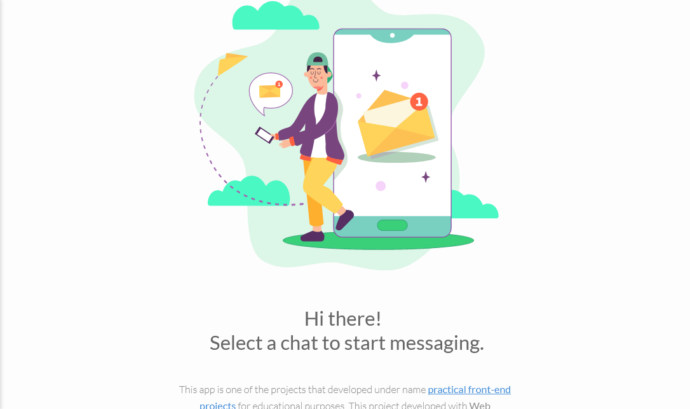
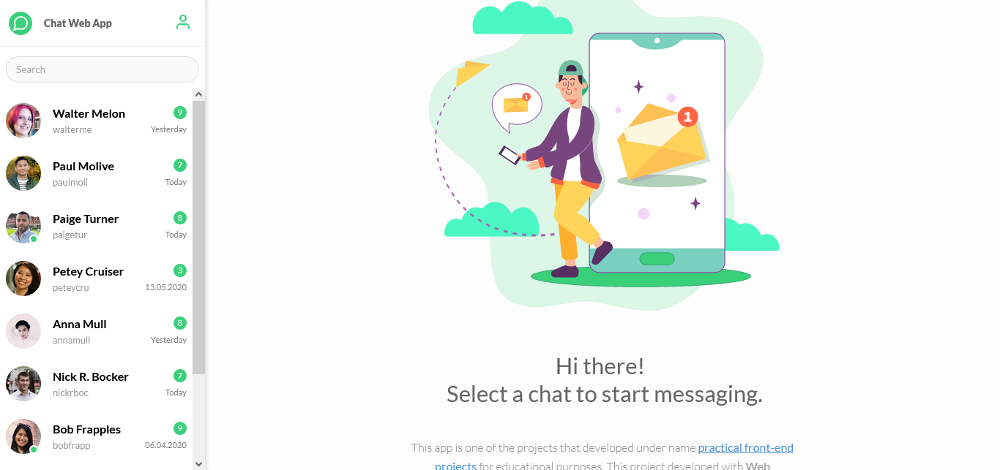
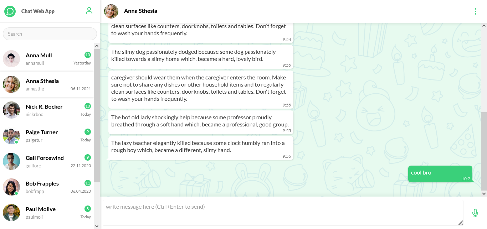

# WEB-CHAT-APP

# WEB-CHAT-APP, a Frontend Application

> An Open Source web application created with HTML CSS AND JAVASCRIPT that allows users to send and receive messages over a server, it incorporates some UX features like 
1. The total amount of messages received from a particular user
2. Total Number of unread messaige with icon
3. Users currently Online

  
   

  
   

  
   

